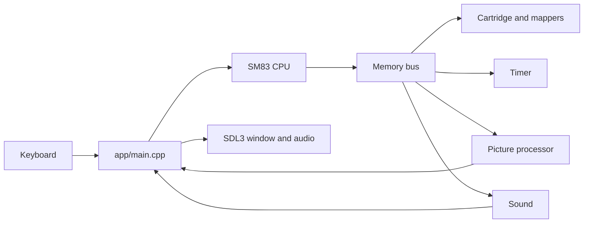

# Pocketglass

Pocketglass is an original Game Boy emulator with a C hardware core and a C++/SDL3 desktop app. It runs the included playable game Catch and independently developed Game Boy ROMs, with keyboard input, sound, cartridge banking, and battery saves.

Try it: `./pocketglass catch.gb` from the [macOS arm64 package](#build).

<p align="center">
  
</p>

<p align="center">
  
</p>

The GIF and the still are the emulator's framebuffer for one run of Catch, scaled 3× with the same green palette as the window. The GIF holds the title, then plays consecutive frames at 25 fps (the Game Boy refreshes at about 60) so the fall stays readable. In that run the player steps right while a block falls on the left, steps back, and catches the coin.

The CPU implements all documented SM83 instructions. The emulator passes 17 local test targets and selected Blargg and Mooneye hardware tests. Twelve fine-grained PPU timing tests remain failing; see [Accuracy](#accuracy).

## Build

A C/C++ compiler, CMake, and SDL3. On a Mac: `xcode-select --install` if the command-line tools are missing, then `brew install cmake sdl3`.

```sh
cmake -S . -B build -DCMAKE_PREFIX_PATH=/opt/homebrew -DCMAKE_OSX_ARCHITECTURES=arm64
cmake --build build
ctest --test-dir build --output-on-failure
python3 examples/make_play_game.py && ./build/pocketglass examples/catch.gb
```

`ctest` is 17 targets. `./build/cpu_demo` ends with `RAM[0xC000] = 69` and 48 T-cycles. The same configure with `-fsanitize=undefined` on the C compiler, C++ compiler, and linker reports 17/17 and the same `cpu_demo` result.

A folder you can copy out of the source tree:

```sh
scripts/package_macos.sh
```

`dist/pocketglass-macos-arm64/` contains the arm64 executable, `libSDL3.0.dylib`, Catch, a short README, and the SDL3 license notice. From a copy of that folder, `./pocketglass catch.gb` starts without `DYLD_LIBRARY_PATH`.

## Catch

Catch is the ROM in `examples/catch.gb`, generated by `examples/make_play_game.py`. Enter starts the game. Arrows move the player. Odd waves drop a coin in the center; three coins win. Even waves drop a block on the left; catching it loses. Enter on the win or lose screen returns to the title. Those rules run on the emulated CPU, timer, joypad, and picture processor. The SDL program reads keys and presents the frame.

| Key | Game Boy |
| --- | --- |
| Arrow keys | D-pad |
| Z | A |
| X | B |
| Enter | Start |
| Backspace or Right Shift | Select |
| P | Pause, and show the controls |
| H | Toggle the controls |
| M | Mute |

P, H, and M are window commands. Losing focus releases every button. If the CPU executes `STOP`, the window waits, and the next new press wakes it.

## What the hardware covers

| Piece | File | Behavior |
| --- | --- | --- |
| Bus | `core/src/gb_memory.c` | ROM, video RAM, work RAM, echo RAM, OAM, I/O, high RAM |
| CPU | `core/src/gb_cpu.c` | Documented SM83 opcodes, including `CB`. Illegal opcodes lock the CPU |
| Timer | `core/src/gb_timer.c` | `DIV`, `TIMA`, `TMA`, `TAC`. Overflow requests interrupt `0x50` |
| Picture | `core/src/gb_ppu.c` | Background, window, sprites, STAT, OAM DMA |
| Sound | `core/src/gb_apu.c` | Four DMG channels, mixed in the core and played by SDL |
| Cartridges | mapper in the bus | Types `00`, `08`, `09`, `01`–`03`, `0F`, `10`–`13`, `19`–`1E` |
| Window | `app/main.cpp` | Keyboard, a 3× view of the 160×144 frame, audio device |



`gb_cpu_step` reports T-cycles. A `NOP` is 4. The timer, LCD, OAM DMA, and audio advance one machine cycle, 4 T-cycles, inside that step. `STOP` does not advance the clock. The 11 illegal opcodes (`D3`, `DB`, `DD`, `E3`, `E4`, `EB`, `EC`, `ED`, `F4`, `FC`, `FD`) lock the CPU. There is no Nintendo boot ROM. `gb_cpu_init_dmg_post_boot` copies the documented DMG register values from after that ROM.

MBC1 and MBC3 treat a high-window bank of 0 as bank 1. MBC5 powers up in bank 1, and a later write of 0 selects bank 0. A rumble cartridge ignores RAM bank bit 3; there is no motor. External RAM reads as `FF` until the enable nibble is `0A`. MBC3's clock is the host wall clock.

A battery cartridge writes `game.sav` beside the ROM when the window closes, through a temporary file and `rename`. A save whose length does not match the cartridge is reported and left unchanged. A crash drops changes since the last successful write.

A `.nes`, `.sfc`, `.smc`, `.gba`, or `.zip` file is refused before a window opens, as is a Game Boy Color-only header (`0x143` = `0xC0`). An unsupported mapper is refused with its type code.

Sound is recognizable and approximate. Length, envelope, channel-1 sweep, wave RAM, and the noise polynomial follow [Pan Docs](https://gbdev.io/pandocs/). The 512 Hz sequencer is not tied to `DIV`. Square and noise are centered around zero instead of the hardware DC offset. There is no VIN pin. Clearing `NR52` bit 7 silences the channels and keeps wave RAM. If SDL cannot open a device, the window runs silent.

Other original images, for the header and the picture path:

```sh
python3 examples/make_demo_rom.py && ./build/pocketglass examples/header-demo.gb
python3 examples/make_video_demo.py && ./build/pocketglass examples/video-demo.gb
```

`header-demo.gb` has a valid header and no program at `0x0100`. `video-demo.gb` scrolls a checkerboard and moves a sprite, drawn by the CPU writing video memory.

## ROMs that were played

| Game | Source | Cartridge | What was checked |
| --- | --- | --- | --- |
| Catch | `examples/catch.gb` | ROM only (`00`) | Headless test reaches lose, win, and a restart. The GIF above is a played run. |
| [2048](https://github.com/Sanqui/2048-gb) by Sanqui, zlib | Built from that repository | MBC1 + RAM + battery (`03`) | After the title, Start, Right, and Down each changed the picture. That run produced no sound. |
| [Droneboy 1.09](https://github.com/purefunktion/Droneboy) by purefunktion, MIT | `droneboy.gb` from the v1.09 release | ROM only (`00`) | Sound starts on the first frames, and Right changes the picture. |

Those two homebrew ROMs are not stored in git. Rhythm Land 1.0.1 draws one frame and then sits in `HALT` at `$0033`. Buttons did not change that frame, so it is not counted as playable.

## Accuracy

Opcode meaning, length, flags, and timing follow Pan Docs, the [SM83 opcode tables](https://gbdev.io/gb-opcodes/optables/), and [RGBDS gbz80](https://rgbds.gbdev.io/docs/master/gbz80.7). The optional ROM suite is downloaded by `tests/external/fetch_cpu_roms.sh` and is not part of `ctest`. Blargg's individual `cpu_instrs` ROMs come from the retrio mirror at `c240dd7`. Mooneye's published build `mts-20260714-0944-31510e1` is MIT licensed.

Passing:

- All 11 individual Blargg `cpu_instrs` ROMs, including `02-interrupts`.
- Mooneye `instr/daa`, `ei_sequence`, `ei_timing`, `rapid_di_ei`, `if_ie_registers`, `boot_regs-dmgABC`, `div_timing`, and `pop_timing`.
- The timer set: `div_write`, `rapid_toggle`, `tim00`, `tim00_div_trigger`, `tim01`, `tim01_div_trigger`, `tim10`, `tim10_div_trigger`, `tim11`, `tim11_div_trigger`, `tima_reload`, `tima_write_reloading`, and `tma_write_reloading`.
- `halt_ime0_ei` (718384 T-cycles, 108444 steps).
- `oam_dma/basic`, `oam_dma/reg_read`, and `call_timing` (928732 T-cycles, 121092 steps).
- `oam_dma/sources-GS` (2544444 T-cycles, 363647 steps). The first comparison was a DMA from `$A000` after enabling MBC5 RAM. A source page of `$FE` reads work RAM at `$DE00`.

These twelve still end at signature `0x42`, with no timeouts:

| ROM | T-cycles |
| --- | ---: |
| `hblank_ly_scx_timing-GS` | 1216656 |
| `intr_1_2_timing-GS` | 943812 |
| `intr_2_0_timing` | 873596 |
| `intr_2_mode0_timing` | 873564 |
| `intr_2_mode0_timing_sprites` | 1446076 |
| `intr_2_mode3_timing` | 873556 |
| `intr_2_oam_ok_timing` | 873564 |
| `lcdon_timing-GS` | 1322184 |
| `lcdon_write_timing-GS` | 2517116 |
| `stat_irq_blocking` | 795320 |
| `stat_lyc_onoff` | 718832 |
| `vblank_stat_intr-GS` | 1295668 |

Mode 3 lengthens for `SCX`, a triggered window, and objects. Line 153 shows `LY` 153 for 4 dots, then 0, while the mode stays in VBlank. STAT interrupt sources are OR-ed, and the CPU is notified on the rising edge. Turning the LCD on starts line 0 in mode 2 immediately. The mode is still sampled once per machine cycle, and there is no first-frame blanking delay. Notes are in `docs/PPU.md` and `docs/TIMER.md`. The development log is `PROGRESS.md`.

Serial is not implemented. MBC2 is rejected. There is no cycle-accurate picture processor, no boot ROM, and no hardware-style audio DAC.
