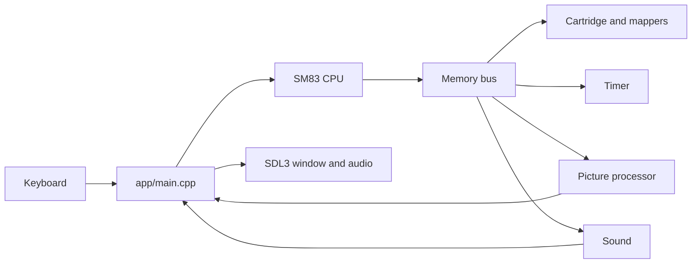

# Pocketglass

A Game Boy emulator for the original DMG, written from public hardware documentation. The machine is a C library. A small C++ program uses SDL3 for the window, keyboard, and speakers.

I built this to practice the work behind an interpreter: a documented instruction set, a memory map, cycle timing, interrupts, and tests that fail when the hardware model is wrong. It runs an original game and a few freely distributed homebrew ROMs. It is not a complete Game Boy, and commercial games are not a supported target.

<p align="center">
  
  
  
</p>

<p align="center">
  <sub>These three frames are labeled placeholders. Replace the PNG files in <code>docs/images/</code> with captures of the real window. The checklist is at the bottom.</sub>
</p>

## What runs

Press Enter on the title screen of Catch, the original ROM in `examples/catch.gb`. Arrows move the player. Odd waves drop a coin in the center. Three coins win. Even waves drop a block on the left. Catching that block loses. Enter returns to the title so you can play again. The rules live in the ROM and run on the emulated CPU, timer, joypad, and picture processor. The SDL program only reads keys and presents the frame.

The same window has also been exercised past the title screen on two independent homebrew ROMs that are not stored in this repository:

| Game | Source | Cartridge | What was checked |
| --- | --- | --- | --- |
| Catch | This repo, `examples/catch.gb` | ROM only (`00`) | A headless test reaches lose, win, and a restart. Keyboard play uses the window. |
| [2048](https://github.com/Sanqui/2048-gb) by Sanqui, zlib | Assembled from that repository | MBC1 + RAM + battery (`03`) | After the title, Start, Right, and Down each changed the picture. That run produced no sound. |
| [Droneboy 1.09](https://github.com/purefunktion/Droneboy) by purefunktion, MIT | `droneboy.gb` from the v1.09 release | ROM only (`00`) | Sound starts on the first frames, and Right changes the picture. |

Rhythm Land 1.0.1 draws one frame and then sits in `HALT` at `$0033`. Buttons did not change that frame and no samples were produced, so it is not counted as playable.

## Why the core looks like this



`gb_cpu_step` reports T-cycles. A `NOP` is 4. The timer, LCD, OAM DMA, and audio advance one machine cycle, which is 4 T-cycles, inside that step. `STOP` does not advance the clock. The 11 illegal opcodes (`D3`, `DB`, `DD`, `E3`, `E4`, `EB`, `EC`, `ED`, `F4`, `FC`, `FD`) lock the CPU. They are not treated as `NOP`.

Every documented legal SM83 opcode is implemented, including the `CB` prefix. There is no Nintendo boot ROM. `gb_cpu_init` is a diagnostic power-on state, and `gb_cpu_init_dmg_post_boot` copies the documented DMG registers from after that ROM.

| Piece | File | What it does |
| --- | --- | --- |
| Bus | `core/src/gb_memory.c` | Routes ROM, video RAM, work RAM, echo RAM, OAM, I/O, and high RAM. |
| Cartridges | `core/src/gb_cartridge.c` and the mapper in the bus | Header parse, MBC1, MBC3 with a host-clock RTC, and MBC5. |
| CPU | `core/src/gb_cpu.c` | Fetch, execute, flags, interrupts, `HALT`, and `STOP`. |
| Timer | `core/src/gb_timer.c` | `DIV`, `TIMA`, `TMA`, and `TAC`. Overflow requests interrupt `0x50`. |
| Picture | `core/src/gb_ppu.c` | Background, window, sprites, STAT, and OAM DMA. |
| Sound | `core/src/gb_apu.c` | The four DMG channels, mixed in the core. |
| Window | `app/main.cpp` | Input, a 3× view of the 160×144 frame, and the audio device. No game rules. |

Supported cartridge types are `00`, `08`, `09`, `01`–`03`, `0F`, `10`–`13`, and `19`–`1E`. A rumble cartridge ignores RAM bank bit 3. There is no motor. MBC1 and MBC3 treat a high-window bank of 0 as bank 1. MBC5 powers up in bank 1, and a later write of 0 really selects bank 0. External RAM reads as `FF` until the enable nibble is `0A`.

A battery cartridge writes `game.sav` beside the ROM when the window closes. The write uses a temporary file and `rename`, so a failed write keeps the previous save. A save whose length does not match the cartridge is reported and is not overwritten. A crash or a kill drops changes since the last successful write. The MBC3 clock is the host wall clock, stored with the latched and live registers in an 18-byte trailer.

## Controls

| Key | Game Boy |
| --- | --- |
| Arrow keys | D-pad |
| Z | A |
| X | B |
| Enter | Start |
| Backspace or Right Shift | Select |
| P | Pause, and show the controls |
| H | Toggle the controls |
| M | Mute |

P, H, and M are window commands, not Game Boy buttons. Losing focus releases every button. If the CPU executes `STOP`, the window waits, and the next new press wakes it.

A `.nes`, `.sfc`, `.smc`, `.gba`, or `.zip` file is refused before a window opens, as is a Game Boy Color-only header (`0x143` = `0xC0`). An unsupported mapper is refused with its type code in the message.

## Sound

The four channels are generated in `gb_apu.c` and queued to SDL as signed 16-bit stereo at 32768 Hz. Length counters, envelopes, channel-1 sweep, wave RAM, and the noise polynomial follow [Pan Docs](https://gbdev.io/pandocs/) closely enough for game audio to be recognizable.

These parts are approximate. The 512 Hz frame sequencer is not tied to `DIV`. Square and noise are centered around zero instead of the hardware DC offset. There is no VIN pin. Clearing `NR52` bit 7 silences the channels and keeps wave RAM. If SDL cannot open a device, the window runs silent. M drops queued samples. It does not clear the game's own registers.

## Build

You need a C/C++ compiler, CMake, and SDL3. On a Mac, install Apple's Command Line Tools if they are missing, then `brew install cmake sdl3`.

```sh
cmake -S . -B build -DCMAKE_PREFIX_PATH=/opt/homebrew -DCMAKE_OSX_ARCHITECTURES=arm64
cmake --build build
ctest --test-dir build --output-on-failure
python3 examples/make_play_game.py && ./build/pocketglass examples/catch.gb
```

`ctest` is 17 targets, including the audio channels. `./build/cpu_demo` ends with `RAM[0xC000] = 69` and 48 T-cycles: load 64, add 5, store 69, halt. The same configure with `-fsanitize=undefined` on the C compiler, C++ compiler, and linker also reports 17/17 and that `cpu_demo` result. AddressSanitizer is not part of the checked configuration on this AppleClang toolchain.

A folder you can copy out of the source tree:

```sh
scripts/package_macos.sh
```

`dist/pocketglass-macos-arm64/` contains the arm64 executable, `libSDL3.0.dylib`, Catch, a short README, and the SDL3 license notice. From a copy of that folder, `./pocketglass catch.gb` should start without `DYLD_LIBRARY_PATH`.

Other original demos, useful when the picture or the header is what you want to inspect:

```sh
python3 examples/make_demo_rom.py && ./build/pocketglass examples/header-demo.gb
python3 examples/make_video_demo.py && ./build/pocketglass examples/video-demo.gb
```

`header-demo.gb` has a valid header and no program at `0x0100`, so the LCD stays empty. `video-demo.gb` scrolls a checkerboard and moves a sprite during VBlank, drawn by the emulated CPU writing video memory.

## Accuracy

Behavior, lengths, flags, and timing follow Pan Docs, the [SM83 opcode tables](https://gbdev.io/gb-opcodes/optables/), and [RGBDS gbz80](https://rgbds.gbdev.io/docs/master/gbz80.7). The optional ROM suite is downloaded by `tests/external/fetch_cpu_roms.sh` and is not part of `ctest`, because those binaries are not committed. Blargg's individual `cpu_instrs` ROMs come from the retrio mirror at `c240dd7`. Mooneye's published build `mts-20260714-0944-31510e1` is MIT licensed.

Passing:

- All 11 individual Blargg `cpu_instrs` ROMs, including `02-interrupts`.
- Mooneye `instr/daa`, `ei_sequence`, `ei_timing`, `rapid_di_ei`, `if_ie_registers`, `boot_regs-dmgABC`, `div_timing`, and `pop_timing`.
- The timer set: `div_write`, `rapid_toggle`, `tim00`, `tim00_div_trigger`, `tim01`, `tim01_div_trigger`, `tim10`, `tim10_div_trigger`, `tim11`, `tim11_div_trigger`, `tima_reload`, `tima_write_reloading`, and `tma_write_reloading`.
- `halt_ime0_ei` (718384 T-cycles, 108444 steps).
- `oam_dma/basic`, `oam_dma/reg_read`, and `call_timing` (928732 T-cycles, 121092 steps).
- `oam_dma/sources-GS` (2544444 T-cycles, 363647 steps). The ROM first compared a DMA from `$A000` after enabling MBC5 RAM. A source page of `$FE` reads work RAM at `$DE00`.

Still failing, all with signature `0x42` and no timeouts. These are not passes:

| ROM | T-cycles |
| --- | ---: |
| `hblank_ly_scx_timing-GS` | 1216656 |
| `intr_1_2_timing-GS` | 943812 |
| `intr_2_0_timing` | 873596 |
| `intr_2_mode0_timing` | 873564 |
| `intr_2_mode0_timing_sprites` | 1446076 |
| `intr_2_mode3_timing` | 873556 |
| `intr_2_oam_ok_timing` | 873564 |
| `lcdon_timing-GS` | 1322184 |
| `lcdon_write_timing-GS` | 2517116 |
| `stat_irq_blocking` | 795320 |
| `stat_lyc_onoff` | 718832 |
| `vblank_stat_intr-GS` | 1295668 |

Mode 3 lengthens for `SCX`, a triggered window, and objects. Line 153 shows `LY` 153 for 4 dots, then 0, while the mode stays in VBlank. STAT interrupt sources are OR-ed, and the CPU is notified on the rising edge. Turning the LCD on starts line 0 in mode 2 immediately. The mode is still sampled once per machine cycle, and there is no first-frame blanking delay, so the twelve ROMs above still stop at the failure signature. The picture-processor notes are in `docs/PPU.md`. The clock notes are in `docs/TIMER.md`.

## Still missing

Serial is not implemented. MBC2 is rejected. There is no cycle-accurate PPU, no boot ROM, and no hardware-style audio DAC. A gameplay screenshot of a title is not treated as proof that the game runs. `PROGRESS.md` is the development log.

## Replace the screenshots

Capture the real window, then overwrite the three files. Do not draw the frames.

1. `docs/images/catch-title.png` — the CATCH title, with START readable.
2. `docs/images/catch-play.png` — the player on screen with a coin or the falling block.
3. `docs/images/controls.png` — the same window with the P-key help overlay up.

From the repo, after `./build/pocketglass examples/catch.gb` is open:

```sh
screencapture -l $(osascript -e 'tell application "System Events" to id of window 1 of process "pocketglass"') docs/images/catch-title.png
```

If that window id is unavailable, `screencapture -i docs/images/catch-title.png` and drag a box around the window. A short GIF, when `ffmpeg` is installed:

```sh
ffmpeg -f avfoundation -i "1:none" -t 8 -vf "fps=12,scale=480:-1" docs/images/catch.gif
```

No demo video was recorded in this repository. Add the GIF link to this README only after that file is a real capture.
